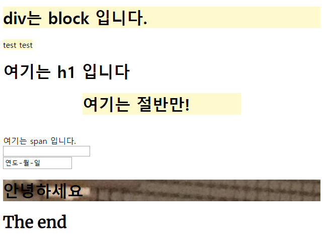
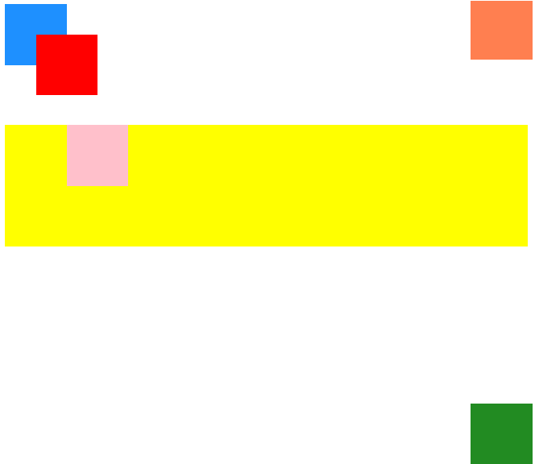
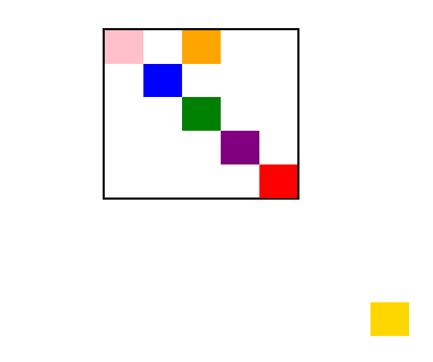

#	20190730 CSS

- HTML은 정보와 구조화

> 정보의 구조화?

- CSS는 styling의 정의

- CSS로 꾸미려면  HTML로 기본 뼈대를 만들어 주어야한다.


## Intro

##### CSS 파일 사용하려면?

1. style 속성을 이용(내부참조)

```html
 <h1 style="color:blueviolet;">CSS intro</h1>
```
> - inline으로 html 꾸미기   태그 사이에 코드를 작성한다.
- CSS는 각각의 프로퍼티와 밸류 에 구분을 위해 ; 을 사용한다.    

<br>

2.  Embedding (내부참조)
```html
<style>
    h2{
        color:coral;
        font-size:100px;
    }
</style>
```

> - head 안에  style 코드를 집어 넣는다.
> - style 사이의 코드는 css코드로 인식한다.
> - 파일 하나에 모든 데이터가 모여있다는 단점이 있다.


3. Link file (외부참조)

```ㅗ싀
<link rel="stylesheet" href="00_intro.css">
```

> - 00_intro.css 를 참조한다.
>
> - 외부의 css 코드를 불러오기 위해서 link 태그를 이용한다.


## Practice


```html
<div>
    <h1>배가 고파요</h1>
</div>
```

- 이런 식으로 <div> 블럭 안에 있으면 <h1>태그는 div의 자식이다. (상속 존재)

<br>

#### id 속성값 부여

```html
 <p id="hello">안녕하세요</p> 
<!-- 픽셀단위 -->
<p id="welcome">반갑습니다</p>
<!-- % 단위 -->
<p id="lunch">점심시간 이에요</p>
<p id="snack">오늘 간식은 도시락</p>
```
<br>
#### id selector

```css
#hello {
    font-size: 50px;
}
```
> css file내에서 id값을 찾는다
>
> id값인 것이라는 의미로 #을 붙여준다.

<br>
<br>

#### class 속성값 부여

```html
<div class="margin-1"></div>
<div class="margin-2"></div>
<div class="margin-3"></div>
<div class="margin-4"></div>
```
<br>

#### class selector

```css
.margin {
    margin-top: 10px;
    margin-bottom: 10px;
    margin-left: 10px;
    margin-right: 10px;
}
```

> css file내에서  class 값인 것이라는 의미로 .을 붙여준다.


- id는 특정한 하나의 값, clss는 해당 속성값을 표현하는 모든 것을 찾음 


###### margin에 여러 값 한 번에 주기

```css

/* 모든 방향 10 */
.margin-1 {
    margin: 10px;
}
/* 상하10  좌우 20 */
.margin-2 {
    margin: 10px 20px;
}
/* 상하 10 좌우 20 하 30 */
.margin-3 {
    margin: 10px 20px 30px;
}
/* 상우좌우 순 */
.margin-4 {
    margin: 10px 20px 30px 40px
}
```


## 프로퍼티 value

#### 1. 키워드

#### 2. 크기단위

   - 픽셀, %(요소에 지정된 사이즈, 상속된 사이즈에 상대적인 사이즈를 설정)
   - em
     - 상대적인것.
     - 배수로 설정한다. 기본(가장 처음)에 비하여 배수 크기로 변한다.
   -  rem
     - em과 rem은 다르다.
     - rem 은 부모와 다르게 독자적으로 가능
     - root 값에 따라서 동작, 일정한 크기
   - view port
     - 화면의 비율이 바뀌면 바뀐다.

#### 3. 색상

   - htmlcolor

   - 1. HEX
        - 16진수
     2. RGB
        - (x,y,z)

     > HEX과 RGB는 똑같은 코드

     ​	3. RGBA


> 여러가지 정보는 필요할 떄마다 W3school 들어가서 확인
>
> caniuse: css 쓸 수 있는지 물어볼 수 있는 사이트
>
> html5test: 지금 사용하고 있는 브라우저의 점수가 보임


### BOX MODEL

- 기본적으로 왼쪽부터 오른쪽까지 전체 영역을 다 차지(오른쪽 margin auto)

- block : 항상 새로운 줄에서 수행 가능하다

- 종류 4가지

  - block
  - inline
  - inline-block
  - none

  > none은 사라지고 hidden은 숨긴것


### Display
  - static
  - relative
  - absolute
  - fixed


## display 코드 전문

### HTML 코드

```html
<!DOCTYPE html>
<html lang="en">
<head>
    <meta charset="UTF-8">
    <meta name="viewport" content="width=device-width, initial-scale=1.0">
    <meta http-equiv="X-UA-Compatible" content="ie=edge">
    <title>Document</title>
    <link href="https://fonts.googleapis.com/css?family=Merriweather&display=swap" rel="stylesheet">

    <link rel="stylesheet" href="03_display.css">
</head>
<body>
    <div>
        <h1>div는 block 입니다.</h1>
    </div>
    
    <div class="half i">
        <span>test</span>
    </div>

    <div class="half i">
        <span>test</span>
    </div>


    <h1>여기는 h1 입니다</h1>
    <div class="half">
        <h1>여기는 절반만!</h1>
    </div>

    <span class="in-b">여기는 span 입니다. </span>
    <input class="b" type="text">
    <!-- <input type="text"> -->
    <input type="date">

    <h1 class="bg">안녕하세요</h1>
    <h1 class="text">The end</h1>
</body>
</html>
```

<br>

### CSS 코드

```css
div {
    background-color: lemonchiffon;
    margin-left: auto;
    margin-right: auto;

}

.half {
    width: 50%;
}

.b {
    display: block;
}

.i {
    display: inline;
    /* margin-top: 100;
     inline에는 margin 값을 줄 수 없다 */
    
}

.in-b {
    display: inline-block;
    margin-top: 20px;
}

.bg {
    background-image: url(https://s3.orbi.kr/data/file/united/1846347971_CwzZ6WOn_tumblr_o0n8es12kq1rxye79o1_1280.jpg)
}

.text {
    font-family:'Merriweather', serif;
}
```

<br>

<br>

### 코드 실행한 결과



<br>

## CSS로 상자 위치 바꾸기


```css
div {
    height: 100px;
    width: 100px;
} 

.blue{
    background-color: dodgerblue;
    position: static;
    /* 기본 값이라서 적나 안 적나 똑같은 결과 */
}

.red {
    background-color: red;
    position: relative;
    /* 원래 위치에 대해 상대적인 위치 */
    left: 50px;
    bottom: 50px;
}

/* red가 움직였지만 레드의 현재 위치에 상관없이
원래 위치에 있다고 생각하여 레드의 원래 위치 밑에 박스가 생성된다. */
.green {
    background-color: forestgreen;
    position: absolute;
    /* left: 25px;
    top: 25px; */
    /* 시작점을 기준으로 움직였다. */
    /* 절대위치, 부모요소 또는 가장 가까운 조사 위치를 통해 움직인다. 
    여기에선 부모요소가 <body>이다. */

    right: 0px;
    bottom: 0px;
    /* body 기준으로 옮기기 때문에 ???? 우측 하단에 위치함 */
}

.parent{
    height: 200px;
    width: 100%;
    background-color: yellow;
    position: relative;
    /* 전후, children이 부모의 색 안에서만 놀수 있게 */
    /* 부모를 기준으로 잡는다. */
}

.children {
    background-color: pink ;  
    position: absolute;
    left: 100px;
    bottom: 100px;
}

/*  노란색이 분홍색을 포함한 것처럼 보임. */

.coral {
    background-color: coral;
    position: fixed;
    right: 0px;
    top: 0px;
}
```


### 실행 결과





## CSS로 상자위치 바꾸기 2

### HTML 코드

```html
<!DOCTYPE html>
<html lang="ko">
<head>
  <meta charset="UTF-8">
  <meta name="viewport" content="width=device-width, initial-scale=1.0">
  <meta http-equiv="X-UA-Compatible" content="ie=edge">
  <title>BOX</title>
  <link rel="stylesheet" href="05_box.css">
</head>
<body>
  <div class="big-box">
    
    <div class="small-box" id="red"></div>
    <div class="small-box" id="gold"></div>
    <div class="small-box" id="green"></div>
    <div class="small-box" id="blue"></div>
    <div class="small-box" id="pink"></div>
    <div class="small-box" id="purple"></div>
    <div class="small-box" id="orange"></div>
  </div>
</body>
</html>
```

<br>

### CSS 코드

```css
.big-box {
    position: relative;
    margin: 100px auto 500px;
    border: 5px solid black;
    width: 500px;
    height: 500px;
  }
  
  .small-box {
    width: 100px;
    height: 100px;
  }
  
   #red {
    background-color: red;
    position: absolute;
    /* // big-box안에 속해 있기 때무네 big-box기준으로 움직인다.  */
    right: 0px;
    bottom: 0px;
  }
  
  #gold {
    background-color: gold;
    position: fixed;
    bottom: 50px;
    right: 50px;
    /* 브라우저의 하단에서 50px, 우측에서 50px 위치에 고정하기 */
  }
  
  #green {
    background-color: green;
    position: absolute;
    left: 200px;
    top: 200px;
    /* absolute 이용해서 큰 사각형의 가운데 위치시키기 */
  }
  
  #blue {
    background-color: blue;
    position: relative;
    top: 100px;
    left: 100px;
    /* relative를 사용해서 큰 사각형 좌측 상단 모서리에서 100px, 100px 띄우기 */
  }
  
  #pink {
    /* background-color: pink;
    position: relative;
    bottom: 100px;
    left: 0px; */
    /* 큰 사각형 내부의 좌측 상단 모서리로 옮기기*/
    background-color: pink;
    position: absolute;
    left: 0px;
    top: 0px;
  } 

  #purple {
      background-color: purple;
      position: relative;
      left: 300px;
      top: 200px;  
  }

  #orange {
    background-color: orange;
    position: relative;
    left: 200px;
    bottom: 200px;
}
```


### 실행화면

